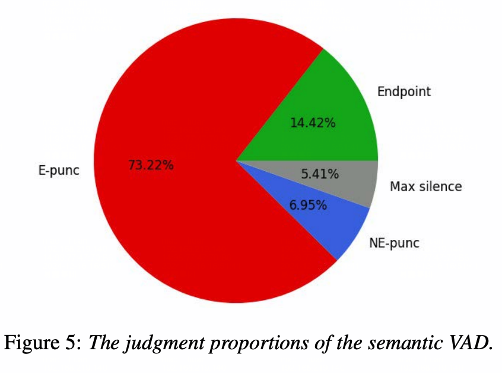

# Note on audio processing

这是一段音频流接收的代码，数据以Chunk流式传过来的，我们要在这个流式服务中，解析音频，触发动作。
```python
"""PyAudio Example: full-duplex wire between input and output."""

import sys

import pyaudio

RECORD_SECONDS = 5
CHUNK = 1024
RATE = 44100

p = pyaudio.PyAudio()
stream = p.open(format=p.get_format_from_width(2),
                channels=1 if sys.platform == 'darwin' else 2,
                rate=RATE,
                input=True,
                output=True,
                frames_per_buffer=CHUNK)

print('* recording')
for i in range(0, int(RATE / CHUNK * RECORD_SECONDS)):
    # 这里要有一个处理逻辑，一般来说，话务返回了一个stream.read(CHUNK)
    # process(stream.read(CHUNK)) 这里需要算法实现，当结果满足某种条件的时候
    # 打断用户的说话

    # 话务需要做这种改变
    # reply_content, interupt = process(stream.read(CHUNK)):
    # if interupt:
    #     do_reply(reply_content)
    # process = whisper_ASR/或者其他的打断模型 + LLM生成回复 + TTS
    
    stream.write(stream.read(CHUNK))
print('* done')

stream.close()
p.terminate()
```

## 1. Packages and installations
1. Install librosa and soundfile to handle audio files.
2. Install pyaudio to perform real-time audio processing.[pyAudio documentation](!https://people.csail.mit.edu/hubert/pyaudio/), follow the instruction to install pyaudio.

On macOS, we use the following method to install
```bash
brew install portaudio
pip install pyaudio
```
3. Download asr model: there are many version of openai Whisper model on huggingface, we choose the tiny one for macOS testing purpose.

4. We may need to install additional libraries such as `ffmpeg`, `libsndfile`, and `portaudio` to handle audio files and real-time audio processing. On macOS, we can use homebrew to install these libraries.
```bash
brew install ffmpeg
brew install libsndfile
brew install portaudio
```

> We may need to create a Docker container to run audio related code, such that the environment is independent of the host machine.


pyaudio full duplex wire mode is useful in real-time audio processing.
```python
"""PyAudio Example: full-duplex wire between input and output."""

import sys
import pyaudio

RECORD_SECONDS = 5
CHUNK = 1024
RATE = 44100

p = pyaudio.PyAudio()
stream = p.open(format=p.get_format_from_width(2),
                channels=1 if sys.platform == 'darwin' else 2,
                rate=RATE,
                input=True,
                output=True,
                frames_per_buffer=CHUNK)

print('* recording')
for i in range(0, int(RATE / CHUNK * RECORD_SECONDS)):
    stream.write(stream.read(CHUNK))
print('* done')

stream.close()
p.terminate()
```

## 2. Parameters and concepts


**Rate**    
The RATE parameter in the context of audio recording and playback refers to the sample rate, which is the number of samples of audio carried per second. It is measured in Hertz (Hz).

In your code, RATE is set to 44100, which means the audio is sampled 44,100 times per second. This is a common sample rate for high-quality audio and is the standard for CD audio.

Here's a brief explanation of why sample rate is important:

Higher sample rates can capture more detail in the audio signal, leading to higher fidelity recordings.
Lower sample rates reduce the amount of data and can be sufficient for applications where high fidelity is not necessary, such as voice recordings.
In summary, RATE = 44100 means that the audio will be recorded at a sample rate of 44,100 samples per second, ensuring high-quality audio capture.

> 音频文件每秒的信号数量。


The total number of audio samples (signal points) recorded will be the sample rate (RATE) multiplied by the duration of the recording (RECORD_SECONDS).

Given: RATE = 44100 samples per second     
RECORD_SECONDS = 5 seconds     
The total number of signal points will be:    
$[ 44100 , \text{samples/second} \times 5 , \text{seconds} = 220500 , \text{samples} ]$


So, the final number of signal points recorded will be 220,500.

---
**Chunk**    
In the context of audio processing, the CHUNK parameter defines the number of frames (samples) that are read from the audio input stream at a time. It essentially determines the size of the buffer used for reading and writing audio data.

Here's a breakdown of its role:

Buffer Size: CHUNK specifies the size of the buffer in frames. In your code, CHUNK is set to 1024, meaning that 1024 frames are processed in each read/write operation.
Latency: A smaller CHUNK size can reduce latency, making the audio processing more responsive. However, it may increase the CPU load due to more frequent read/write operations.
Efficiency: A larger CHUNK size can be more efficient in terms of CPU usage, as it reduces the number of read/write operations. However, it can increase latency.
In your code, the CHUNK size is used in the loop that reads audio data from the input stream and writes it to the output file:

This loop reads CHUNK frames at a time from the audio input stream and writes them to the output file, repeating until the total recording duration is reached.

In summary, CHUNK = 1024 means that audio data is processed in chunks of 1024 frames at a time.


The expression RATE // CHUNK * RECORD_SECONDS calculates the total number of chunks that will be processed during the recording period.

Here's the step-by-step breakdown:

RATE // CHUNK: This calculates how many chunks fit into one second of audio. Given RATE = 44100 samples per second and CHUNK = 1024 samples per chunk: $[ \text{Chunks per second} = \frac{44100}{1024} \approx 43 ]$

RATE // CHUNK * RECORD_SECONDS: This calculates the total number of chunks for the entire recording duration. Given RECORD_SECONDS = 5 seconds: $[ \text{Total chunks} = 43 \times 5 = 215 ]$

So, the loop will iterate 215 times, reading and writing 1024 samples (one chunk) each time, to cover the entire 5-second recording period.

> 多少个信号点，放到流里面传输一次
---
**Streaming**     
The stream object in PyAudio functions similarly to a Python generator, providing a continuous flow of audio data in chunks of the specified size. Here's a more detailed explanation:

Opening the Stream: The stream object is created using the p.open() method, which sets up the audio input stream with the specified format, channels, and rate.

FORMA
Reading Data in Chunks: The stream.read(CHUNK) method reads the next CHUNK size of audio data from the input stream. Each call to stream.read(CHUNK) returns the next 1024 samples (in this case) of audio data.

Stateless Operation: The stream object does not maintain state about the previously read data. Each call to stream.read(CHUNK) is independent and only returns the current chunk of audio data. This is similar to how a generator yields the next value in a sequence without retaining information about previous values.

Writing Data: The read data is then written to the output file using wf.writeframes(). This process continues until the total number of chunks for the recording duration is processed.

In summary, the stream object acts like a valve, providing a continuous flow of audio data in chunks. It does not retain information about previously provided data, focusing only on the current chunk being read.

> 流式处理的逻辑

---
**Channels**    
The CHANNELS parameter specifies the number of audio channels to be used for recording or playback. It determines whether the audio will be recorded in mono (single channel) or stereo (two channels).

In your code:

Mono (1 channel): If the system platform is macOS ('darwin'), CHANNELS is set to 1. This means the audio will be recorded in mono, using a single audio channel.
Stereo (2 channels): For other platforms, CHANNELS is set to 2. This means the audio will be recorded in stereo, using two audio channels (left and right).
Here's a brief explanation of the two modes:

Mono (1 channel): All audio is recorded into a single channel. **This is often sufficient for voice recordings or situations where spatial audio information is not important.**     
Stereo (2 channels): Audio is recorded into two separate channels, typically representing the left and right speakers. This is used for music and other applications where spatial audio information is important.
In summary, the CHANNELS parameter determines whether the audio is recorded in mono or stereo, based on the system platform.

> 简单的场景，非音乐类的场景，选择单声道是足够的

---
**Frame**    
In the context of audio processing, a frame is not a single data point but rather a collection of samples, one for each channel.

Given your setup:

Mono (1 channel): A frame consists of a single sample.
Stereo (2 channels): A frame consists of two samples, one for the left channel and one for the right channel.
So, in your case, if you are recording in stereo, each frame will contain two data points (samples).

The writeframes method writes these frames to the file. When you call stream.read(CHUNK), it reads CHUNK frames from the audio input stream, and wf.writeframes writes these frames to the output file.

Here's a breakdown:

Mono (1 channel): Each frame is a single sample.
Stereo (2 channels): Each frame consists of two samples (one for each channel).
So, if CHUNK = 1024:

In mono, stream.read(CHUNK) reads 1024 samples.
In stereo, stream.read(CHUNK) reads 1024 frames, which equals 2048 samples (1024 for each channel).
In summary, a frame is a collection of samples, one for each channel. The writeframes method writes these frames to the file, and the number of data points per frame depends on the number of channels.

> 如果是单声道，Frame就是一个数据点，如果是2声道，frame就是2个数据点，有多少个channel，每个frame就有多少个数据点(sample)


## 3. 参考文章
[1. VAD打断参考文章](https://cloud.tencent.com/developer/article/2369279)                   
[2. 中科院+阿里的VAD论文(2023)](https://arxiv.org/pdf/2305.12450)    
传统的VAD需要再语音结束后等待一小段时间，才能判断语音的阶段点，导致用户体验差，这篇文章考虑再传统的静默检测VAD模型后加入一个frame级别标点检测。


**a: 标点打断优化逻辑：**    
- 当发现一个结束标点（ending punctuation）的时候，这代表一个完整语意块的结束，这时可以采用一个相对较小的静默时间。 (300ms)
- 当发现一个非结束标点 (non-ending punctuation)的时候，可以选择一个相对长一点点的静默时间。 (400ms)
- 当一直没有发现一个标点的时候，我们可以选择默认的静默等待时间(700ms)   

**b: 分类任务label：**        
在传统的speech presence 和speech absence的基础上，新增了endpoint类别。
endpoint的label逻辑就是上述的标点符号的逻辑，不同之处在于，通过标点判断静默时间实在prediction的时候发生，而endpoint是在训练的时候就考虑。  

**c: 训练语意损失(类似一个AutoEncoder)**    
语义损失只在训练阶段考虑，作用时为了辅助模型优化，在推理阶段，VAD模块可以单独使用，不用去考虑语义推理这个部分。想一下，如果只训练VAD，Encoder可能丢失原音频中的上下文信息，这一步的目的是保持这部分信息。

**d: 音频编码器 (支持Streaming)**   
使用Contextual blcok conformer (CNN + Transformer)进行音频编码，传入一个上下文向量，提供上下文信息，音频信息通过音频编码器处理后得到一个frame级别的特征表示。

**e: 推理**   
- 检测到结束标点，等待$t_E$后打断。
- 检测到非结束标点，等待$t_{NE}$打断。
- 检测到endpoint(classification)，直接打断。
- 什么都没检测到，静默$t_{Max}$后打断


**f: 效果图**



减少静默等待时间53% （内部数据集测试）

[3. whisper能否用来做流式ASR (Youtube)](https://www.youtube.com/watch?v=_spinzpEeFM)

[4. whisper streaming](https://github.com/ufal/whisper_streaming)

[5. fast_whisper](https://github.com/SYSTRAN/faster-whisper)

[6. Speech LLM (Youtube)](https://www.youtube.com/watch?v=MyxgEx4_Moo)

[7. 中文开源模型FunASR](https://arxiv.org/pdf/2305.11013v1), [VAD模型FMSNhuggingface仓库](https://huggingface.co/funasr/fsmn-vad-onnx)

[8. 实时大模型神经有限状态机](https://arxiv.org/pdf/2405.19487)    
**感知模块的流式处理**    
首先我们需要有一个感知模块，感知就是ASR，ASR接收640ms的流式chunk（一小个音频片段，见上文chunk），翻译成文本token，送给大模型。

**状态转换**    
定义S: Start do something, C: continue do something.     
C.SPEAK = 继续说   
S.LISTEN = 开始听   
C.LISTEN = 继续听   
S.SPEAK = 开始说   
在某个时间点：LLM做以下之一的事件   
1） 接收一个外部来的token
2） 输出一个文本token
3） 输出一个特殊的状态


1. 论文中的模型是专门训练过的。
2. Prompt也需要精细的调整。
3. 全双工的大模型，再加上RAG的流程，会不会太复杂，逐个token输出是不是也比复杂。
4. 模型未开源，实现起来的难度很大。
5. 采用Llama8B时间比较快，千问72能不能满足要求。
6. Output时候，因为一次只输出一个token所以快，还是挺牛逼的。

[9. TDM-面壁](https://arxiv.org/pdf/2406.15718)

> 在接收到输入流之后，一旦发现模型有输出，直接转TTS输出即可。
> 需要改变LLM的对话方式，有重新训练成本。

i. Time slicing: 这里不是按照ASR后标点符号分割的chunk，是按照音频的时间分割的。文章说2秒的小时间步能够有效的平衡效果和速度，正常人一分钟说110 -170个词语，2秒的间隔内，能够收集到4-6个词语。

ii. SFT微调了一个双工模型, Duplex-UltraChat。这个模型的messages按时间切分为小片段。双工的每个个体都能打断对方，开始说话。相当于把静默检测的能力SFT到大模型里面去了。用户的信息被随机切分为4-6个词语的小片段，assitant的文本切分成10词的小片段。

iii. 数据：不考虑打断的情况下，双工的对话数据，被切分成了小片段，当一方的片段没有说完的时候，另一方的回复永远是<idle>. 考虑打断的时候，数据的构建又分了多个场景。
1. Basic： 就是不考虑打断的场景，正常对话。
2. Interweaving： 话题交织，复杂场景下，多个换题交错在对话中的，无打断语料。
3. 生成终止： user不管assitant是否再说，仍然咔咔说的时候，assitant就生成终止了。（学会闭嘴）
4. 重新生成： user对assistant的生成的东西，表示不满意。
5. 对话重置： 用户想要开始一个全新的换题。
6. 回归主题： 用户打断了一下，但是马上又想回到主题。    
有打断时的数据构建：    


## 产品调研
当用户问到什么价格的时候，转入了其他的固定话术，双工的模型不负责具体的业务，没有rag模型，流程的触发都靠的是关键词命中，不可以当作功能型双工客服用的。   
流程的配置相对复杂，定义的关键词足够多的时候，才能保证业务节点有回复。    


## VAD 结果调研

[FSMN VAD](https://github.com/modelscope/FunASR?tab=readme-ov-file)    

```python
from funasr import AutoModel
model = AutoModel(model="fsmn-vad", model_revision="v2.0.4")
res = model.generate(input="output.wav")

# 这个结果返回的是所有有效的音频片段，并没有告诉我们是否要打断用户说话。
# 针对这个情况，我们更倾向于用标点符号判断完整的语义
>> [{'key': 'output', 'value': [[950, 4970]]}]
```

Note: The output format for the streaming VAD model can be one of four scenarios:

[[beg1, end1], [beg2, end2], .., [begN, endN]]：The same as the offline VAD output result mentioned above.
[[beg, -1]]：Indicates that only a starting point has been detected.
[[-1, end]]：Indicates that only an ending point has been detected.
[]：Indicates that neither a starting point nor an ending point has been detected.
The output is measured in milliseconds and represents the absolute time from the starting point.


## 方案探讨  


**需要标点符号辅助判断语义块**     
如果流式ASR不支持添加标点符号，可以使用开源模型。
```python
model = AutoModel(model="ct-punc", model_revision="v2.0.4")
res = model.generate(input="那今天的会就到这里吧 happy new year 明年见")
print(res)

>> [{'key': 'rand_key_2yW4Acq9GFz6Y', 'text': '那今天的会就到这里吧，happy new year,明年见。', 'punc_array': tensor([1, 1, 1, 1, 1, 1, 1, 1, 1, 2, 1, 1, 2, 1, 1, 3])}]

model.generate(input="我今天吃了好多饭 特别撑 难受死了")
>> [{'key': 'rand_key_NO6n9JEC3HqdZ',
  'text': '我今天吃了好多饭，特别撑，难受死了。',
  'punc_array': tensor([1, 1, 1, 1, 1, 1, 1, 2, 1, 1, 2, 1, 1, 1, 3])}]
```


